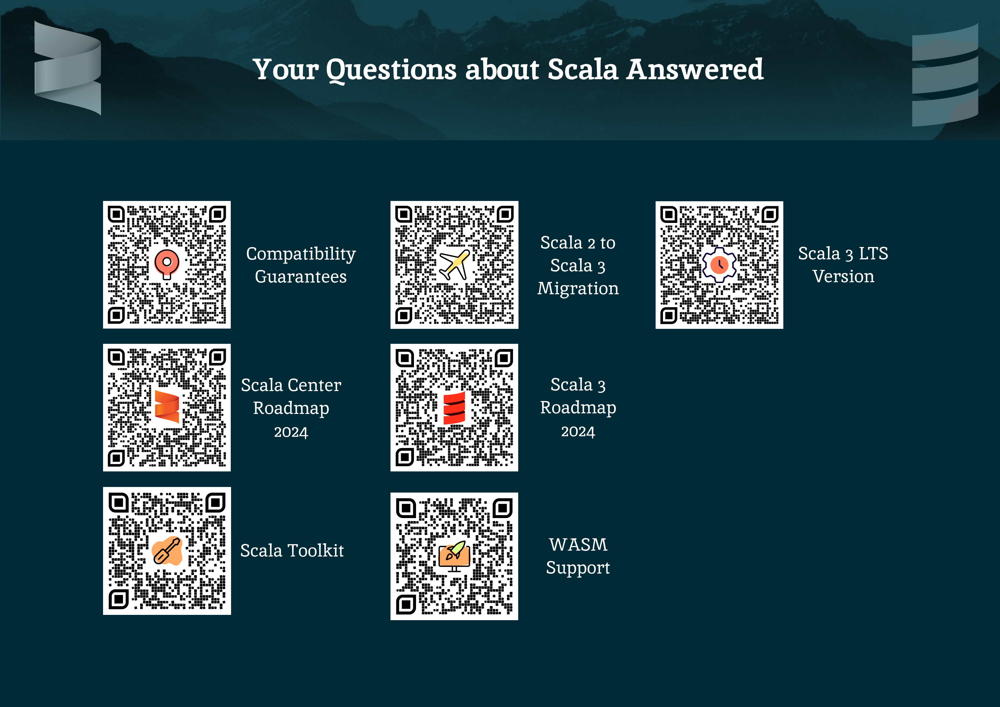

# Scala Ambassadors

Scala Ambassadors are leaders and key figures in the Scala community.

Ambassadors have volunteered to work with the Scala Center and the community to:

* promote a positive image of Scala
* improve communication between everyone involved with Scala
* aid and support each other's efforts

## The Ambassador Role

Ambassadors are encouraged to:

- Be present whenever possible at their local community events.
- Start new community events if they aren't already happening.
- Be visible to other community members as Ambassadors.
- Be perceived by the other community members as go-to people to find high quality answers to Scala-related questions
- Relay community feedback to the Scala organization

The Center selects Ambassadors who have:

- Strong knowledge of Scala and its community
- A positive track record of activity in the community - conferences, meetups, forums, chat rooms, open source projects, and so on
- No track record of unprofessional behavior

Want to be an Ambassador? Please get in touch!

## Resources

The following are the links to resources that clarify various aspects of the story around Scala, its development and usage (TBD):

- [Compatibility Guarantees](https://virtuslab.com/blog/technology/the-scala-3-compatibility-story/)
- [Scala Center Roadmap for 2024](https://www.scala-lang.org/blog/2024/02/06/scala-center-2024-roadmap.html)
- Scala Roadmap -- to be published soon
- [Scala Toolkit](https://docs.scala-lang.org/toolkit/introduction.html)
- [Migrating from Scala 2 to Scala 3](https://docs.scala-lang.org/scala3/guides/migration/compatibility-intro.html)
- Scala.js 1.x and Scala Native 0.4.x/0.5.x are both fully supported on Scala 3 (no real link for that but [this blog post](https://www.scala-lang.org/2020/11/03/scalajs-for-scala-3.html) is a good resource if you *really* want a link).
- Scala on Wasm (WebAssembly) is an experiment in progress (see [GitHub issue](https://github.com/scala-js/scala-js/issues/4928))
- [Scala 3 LTS](https://www.scala-lang.org/blog/2023/05/30/scala-3.3.0-released.html)
- [Scala 3 Roadmap 2024](https://virtuslab.com/blog/technology/scala-3-roadmap-for-2024/)

During events, you can also print and use the following leaflet with the above links as QR codes:

