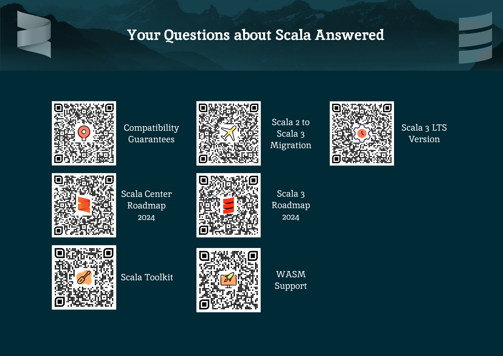

## What are Scala Ambassadors?

See the [Scala Ambassadors page](https://www.scala-lang.org/ambassadors/).

## What is this repo?

This repository contains resources for Ambassadors to use in their community-building activities.

For example, we might develop materials on how someone can start a new Scala meetup, or become a speaker at one. If one Ambassador already has a good answer to those and other questions, they can share it with the other Ambassadors here.

## Resources for Ambassadors

### Discord channel

Ambassadors can talk to each other on the private #ambassadors channel on the [Scala Discord](https://discord.com/invite/scala).

(If you are an Ambassador but don't have access to the channel, contact the Scala Center.)

### Leaflet

During events, you can also print and use the following leaflet with the above links as QR codes:

### Links

The following are the links to resources that clarify various aspects of the story around Scala, its development and usage (TBD):

- [Compatibility Guarantees](https://virtuslab.com/blog/technology/the-scala-3-compatibility-story/)
- [Scala Center Roadmap for 2024](https://www.scala-lang.org/blog/2024/02/06/scala-center-2024-roadmap.html)
- [Scala Toolkit](https://docs.scala-lang.org/toolkit/introduction.html)
- [Migrating from Scala 2 to Scala 3](https://docs.scala-lang.org/scala3/guides/migration/compatibility-intro.html)
- Scala on Wasm (WebAssembly) is an experiment in progress (see [GitHub issue](https://github.com/scala-js/scala-js/issues/4928))
- [Scala 3 LTS](https://www.scala-lang.org/blog/2023/05/30/scala-3.3.0-released.html)
- [Scala 3 Roadmap 2024](https://virtuslab.com/blog/technology/scala-3-roadmap-for-2024/)

